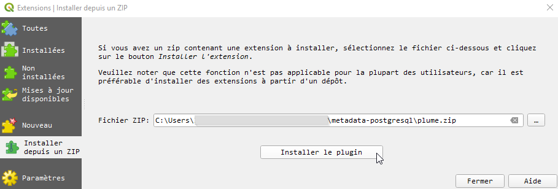
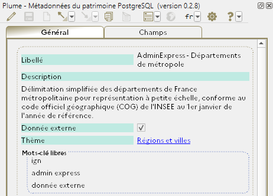
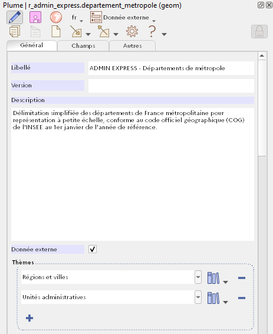

# Plume : gestion des métadonnées du patrimoine PostgreSQL

Plume, pour *PLUgin MEtadonnées*, est un plugin QGIS de consultation et saisie des métadonnées pour les tables et vues PostgreSQL. Lui est adjoint une petite extension PostgreSQL, *PlumePg*, qui organise le stockage de modèles de fiches de métadonnées partagés entre tous les utilisateurs d'un service.

Les métadonnées sont stockées au format RDF (JSON-LD) dans les descriptifs PostgreSQL des objets. L'utilisateur y accède en cliquant sur les couches dans l'explorateur de QGIS ou dans le panneau des couches. Plume prend en charge les tables, tables partitionnées, tables étrangères, vues et vues matérialisées.

Plume se base sur le profil [GeoDCAT-AP 2.0](https://semiceu.github.io/GeoDCAT-AP/releases/2.0.0/) de [DCAT v2](https://www.w3.org/TR/vocab-dcat-2/), qui constitue un socle de métadonnées communes et échangeables, tout en permettant une large personnalisation des catégories de métadonnées présentées à l'utilisateur lorsqu'il est couplé avec l'extension PostgreSQL *[PlumePg](/postgresql)*.

## Environnement

Le plugin QGIS Plume est prévu pour fonctionner avec :
- un système d'exploitation Windows (développé sous Windows 10, non testé avec d'autres versions) ;
- QGIS 3.10 ou supérieur ;
- PostgreSQL 10 ou supérieur.

### Dépendances

La bibliothèque [RDFLib](https://pypi.org/project/rdflib/), qui n'est pas nativement présente dans les distributions de QGIS, est packagée dans le plugin et installée en parallèle. Il en va de même pour les bibliothèques dont elle dépend.

Plume incorpore également le package [`wheel`](https://pypi.org/project/wheel/), qui permet de gérer les bibliothèques sous forme de fichiers *wheel*, plus légers et rapides à installer.

Pour la liste complète, on se réfèrera au fichier [plume/requirements.txt](/plume/requirements.txt).

## Installation

### Automatiquement

Plume est prochainement disponible sur le [dépôt interministériel des plugins QGIS](http://piece-jointe-carto.developpement-durable.gouv.fr/NAT002/QGIS/plugins/plugins.xml).

Si ce dernier a été configuré comme source dans le gestionnaire d'extensions de QGIS, l'utilisateur trouvera donc Plume dans la liste des plugins du menu `Extension > Installer / Gérer les extensions`. Plume pourra être installé et mis à jour via ce dispositif.

### Manuellement

Il est également possible de télécharger une [archive ZIP du code du plugin](https://github.com/MTES-MCT/metadata-postgresql/releases) et d'utiliser la fonctionnalité `Extension > Installer / Gérer les extensions > Installer depuis un zip`.

## Usage courant

1. Pour lancer Plume, cliquez sur son icône dans la barre d'outils de la fenêtre principale de QGIS : 

2. Sélectionnez une couche PostgreSQL dans l'explorateur ou le panneau des couches. Si elles ont été renseignées, ses métadonnées apparaissent dans le panneau de Plume (ou, selon la configuration, la fenêtre de Plume).

3. Si vous êtes habilité à éditer les métadonnées de la couche (membre du rôle propriétaire de la table ou de la vue), vous pouvez activer le mode édition en cliquant sur le crayon  dans la barre d'outils de Plume.

4. Une fois les modifications réalisées, cliquez sur la disquette  pour enregistrer. Vous pouvez également quitter le mode édition sans sauvegarder en cliquant de nouveau sur le crayon .

## Documentation

Documentation technique : https://mtes-mct.github.io/metadata-postgresql.

Documentation utilisateur : https://snum.scenari-community.org/Plume/Documentation.

## Crédits

© République française, 2022-2024.

### Éditeur

Direction du Numérique du ministère de la Transition écologique et de la Cohésion des territoires.

### Auteurs

- Didier Leclerc : intégration, développement de l'interface utilisateur et de l'interface avec le serveur PostgreSQL, rédaction de la documentation utilisateur.
- Leslie Lemaire : conception et développement des mécaniques sous-jacentes (modules [plume.rdf](plume/rdf), [plume.pg](plume/pg) et [plume.iso](plume/iso)), création des logos et icônes, rédaction de la documentation technique et de la documentation utilisateur.

## Contact

Via les issues du [dépôt GitHub](https://github.com/MTES-MCT/metadata-postgresql) ou par mél à drc.uni.dnum.sg@developpement-durable.gouv.fr.

## Licence

Plume est publié sous licence [GNU Affero General Public Licence v3.0 ou plus récent](https://spdx.org/licenses/AGPL-3.0-or-later.html).
