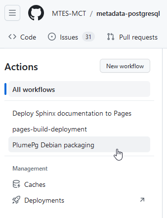
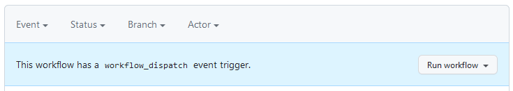
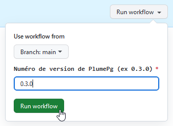

# Création d'un paquet Debian pour PlumePg

Afin de faciliter sa distribution sur les serveurs [EcoSQL](https://spote.developpement-durable.gouv.fr/offre/ecosql-postgresql) du pôle ministériel, et l'installation sous Debian d'une manière générale, un paquet Debian doit être créé pour chaque nouvelle version de l'extension PostgreSQL PlumePg.

À date, le processus est activé manuellement, via une action GitHub. Il nécessite au préalable la mise à jour de métadonnées dans les sources des fichiers de documentation du paquet.

La plupart des fichiers qui interviennent dans la construction du paquet se trouvent dans le répertoire dédié {file}`/admin/debian`. L'action GitHub est définie dans {file}`.github/workflow/debian-build.yml`.

## Fichiers de PlumePg

Le processus prévoit que :
- les fichiers de la nouvelle version de PlumePg soit placés à la racine du répertoire {file}`/postgresql` ;
- les versions antérieures se trouvent dans le répertoire {file}`/postgresql/archives`.

Le paquet inclura le fichier `/postgresql/plume_pg.control`, tous les fichiers de {file}`/postgresql` dont le nom est de la forme `plume_pg--[...].sql` et tous les fichiers `plume_pg--[...]--[...].sql` de {file}`/postgresql/archives` (fichiers de mise à jour).

Il s'agit de l'emplacement normal de ces fichiers, aucune opération supplémentaire n'est nécessaire pour le paquet Debian.

Le fichier `/README.md` est également inclus dans le paquet. Il doit être mis à jour d'autant que de besoin.

## Documentation

Le paquet Debian inclut une note de version très synthétique, qui doit être complétée manuellement : {file}`admin/debian/doc/changelog`. La description de la nouvelle version est ajoutée à celles des versions précédentes. Elle porte uniquement sur les évolutions de PlumePg et non celles de Plume en général.

Cf. [Documentation de Debian](https://www.debian.org/doc/debian-policy/ch-source.html#s-dpkgchangelog) pour le contenu et formalisme.

Le fichier {file}`admin/debian/doc/copyright` contient les informations relatives aux droits de propriété intellectuelle, dont la licence. Les éléments suivants peuvent requérir des mises à jour régulières :
* adresse de contact ;
* nom des ministères ;
* années dans le copyright.

Cf. [Documentation de Debian](https://www.debian.org/doc/packaging-manuals/copyright-format/1.0/) pour le contenu et formalisme.

De manière similaire, le fichier {file}`admin/debian/DEBIAN/control` ne requiert pas de mise à jour systématique à chaque version, mais il peut néanmoins être nécessaire de l'actualiser de temps en temps (noms des ministères, adresse de contact, estimation du volume des fichiers à installer).

Cf. [Documentation de Debian](https://www.debian.org/doc/debian-policy/ch-controlfields) pour le contenu et formalisme (paquet binaire).

## Génération du paquet

L'action permettant de construit le paquet peut être déclenchée depuis l'interface web de GitHub, onglet *Actions*. Elle se nomme *PlumePg Debian packaging*.

Lorsque l'action est sélectionnée, et sous réserve de disposer des droits nécessaires, GitHub affiche dans un bandeau bleu un bouton *Run workflow* qui permet de l'exécuter.

Il sera demandé de préciser manuellement le numéro de version. Il s'agit de la version de PlumePg et non de Plume, sans le "v". Par exemple `'0.3.0'` pour la version v0.3.0 de PlumePg qui accompagnait Plume v1.0.0.

## Téléchargement du paquet

Pour télécharger manuellement le paquet, il faut cliquer sur le "run" après la fin de son exécution. Le fichier `.deb` se trouve dans l'archive ZIP `plume-pg-deb` qui apparaît dans le cadre *Artifacts*. Il suffit de cliquer sur son nom pour la télécharger.
