# Publication d'une nouvelle version

Ci-après le processus de préparation de la publication d'une nouvelle version de Plume, étape par étape.

## Mise à jour des bibliothèques Python

Les bibliothèques Python dont dépend Plume sont listées dans le fichier [`plume/requirements.txt`](https://github.com/MTES-MCT/metadata-postgresql/blob/main/plume/requirements.txt). Leurs fichiers d'installation sont de plus intégrés au plugin, afin que celui-ci puisse être installé en toutes circonstances, indépendemment de la configuration réseau de l'utilisateur (proxy, etc.). Les paquets sont stockés au format *wheel* dans le répertoire `plume/bibli_install`.

Avant de publier une nouvelle version de Plume, il convient de vérifier si de nouvelles versions sont disponibles pour chacune des bibliothèques, en veillant à la compatibilité des bibliothèques entre elles et avec les différentes versions de Python prises en charge. Par exemple les versions d'*importlib-metadata* supérieures à la 4.13.0 ne sont pas compatibles avec RDFLib 6.3.2 - cf. [issue #145](https://github.com/MTES-MCT/metadata-postgresql/issues/145) -, et Python 3.7 n'est plus pris en charge par RDFLib à compter de la version 7.0.0 - cf. [issue #168](https://github.com/MTES-MCT/metadata-postgresql/issues/168).

Voir aussi [Gestion des dépendances](./memo.md#gestion-des-dépendances).

## Numéro de version

Le numéro de la nouvelle version doit être renseigné :
- Dans le paramètre `version` du fichier [`plume/metadata.txt`](https://github.com/MTES-MCT/metadata-postgresql/blob/main/plume/metadata.txt) destiné à QGIS.
- Dans les paramètres `PLUME_VERSION` (sous forme littérale) et `PLUME_VERSION_TPL` (tuple de chiffres) du fichier de configuration [`plume/config.py`](https://github.com/MTES-MCT/metadata-postgresql/blob/main/plume/config.py). 

`PLUME_VERSION` est une information importante, car le mécanisme de mise à jour des bibliothèques Python dont dépend Plume repose sur le fait que ce numéro est différent d'une version de Plume à l'autre. Pour que le processus de mise à jour ne se déclenche pas inutilement à chaque activation de Plume, mais uniquement lors de son installation initiale ou après une mise à jour, Plume compare le numéro de la version courante avec le numéro mémorisé dans le fichier de configuration `QGIS3.ini` pour la version de QGIS considérée. Par exemple, `Generale\3-22-8=v1.1.0` indique que la version de Plume installée sous QGIS 3.22.8 est la v1.1.0. Si les deux numéros sont différents, le processus de mise à jour selon [`plume/requirements.txt`](https://github.com/MTES-MCT/metadata-postgresql/blob/main/plume/requirements.txt) se lance et la version référencée dans le fichier de configuration est actualisée. Ce mécanisme est géré par `plume.bibli_install.manageLibrary`.

Il est donc important de ne pas diffuser aux utilisateurs plusieurs versions portant le même numéro, y compris à des fins de tests. Il est tout à fait possible d'inclure un suffixe dans le numéro de version, par exemple `v1.1.0-beta`, étant entendu que celui-ci n'apparaîtra pas dans `PLUME_VERSION_TPL` (qui n'est pas utilisé pour l'heure).

La numérotation des versions suit les règles de la [gestion sémantique de version](https://semver.org/lang/fr/), résumée comme suit :

> Étant donné un numéro de version MAJEUR.MINEUR.CORRECTIF, il faut incrémenter :
>    * le numéro de version MAJEUR quand il y a des changements non rétrocompatibles,
>    * le numéro de version MINEUR quand il y a des ajouts de fonctionnalités rétrocompatibles,
>    * le numéro de version de CORRECTIF quand il y a des corrections d’anomalies rétrocompatibles.

Le fichier `plume/config.py` comprend également les paramètres `PLUME_PG_MIN_VERSION` et `PLUME_PG_MAX_VERSION`, qui déterminent les versions de l'extension PostgreSQL PlumePg qui sont ou non compatibles avec cette version de Plume. Ils sont utilisés par la requête de contrôle {py:func}`~plume.pg.queries.query_plume_pg_check` du module {py:mod}`plume.pg.queries`, grâce à laquelle Plume détermine s'il doit considérer que PlumePg est disponible sur une base de données ou non. Les versions non compatibles sont ignorées.

## Mise en cohérence des données

Entre le plugin QGIS, l'extension PostgreSQL PlumePg et la documentation technique, certaines données de Plume sont dupliquées, et il importe de maintenir leur cohérence. Des fonctions d'administrations sont prévues pour faciliter ces opérations.

- [Mise à jour de la liste des métadonnées communes de la documentation technique](./memo.md#mise-à-jour-de-la-liste-des-métadonnées-communes-de-la-documentation-technique).
- [Mise à jour des catégories communes dans les scripts de PlumePg](./memo.md#mise-à-jour-des-catégories-communes-dans-les-scripts-de-plumepg).
- [Mise à jour des copies locales des modèles pré-configurés de PlumePg](./memo.md/#modifier-les-modèles-pré-configurés-de-plumepg).

À noter que le module {py:mod}`admin.consistency` de la recette de Plume inclut des tests qui veillent à la cohérence des données et peuvent alerter sur le fait que les fonctions susmentionnées doivent être exécutées.

La gestion des modèles requiert aussi, dans le module [`plume.mapping_template`](https://github.com/MTES-MCT/metadata-postgresql/blob/main/plume/mapping_templates.py), un ensemble de données qui décrivent les champs des tables et les valeurs des types énumérés de PlumePg. Ces informations ne peuvent être saisies que manuellement, par contre des tests vérifient que les noms des champs et des valeurs énumérées renseignées dans ce module correspondent exactement à ceux qui sont définis par PlumePg.

## Tests

### Recette des mécaniques internes

Avant la publication d'une nouvelle version, les tests de Plume et PlumePg doivent être exécutés :
- Pour toutes les versions de PostgreSQL avec lesquelles l'outil est présenté comme compatible. Cela devrait toujours inclure la dernière version officiellement diffusée.
- Pour la version de RDFLib intégrée et, si elle est différente, la version publiée la plus récente.
- Au moins pour les versions de Python incluses dans les distributions de QGIS la plus ancienne et la plus récente avec lesquelles la compatibilité est affichée.

Le détail des tests réalisés devra apparaître dans la [note de version](#rédaction-dune-note-de-version) ou dans une issue à laquelle renvoie la note de version.

Les tests sont lancés par la fonction {py:func}`~admin.tests.run` du module {py:mod}`admin.tests`. Cf. [Exécution des tests](./memo.md#exécution-des-tests) pour plus de détails.

### Recette de l'interface utilisateur

Cf. [Test de l’interface utilisateur](./ui_test.md).

## Mise à jour de la documentation

### Documentation technique 

*URL de publication : https://mtes-mct.github.io/metadata-postgresql/*

La documentation technique, dont les sources se trouvent dans le répertoire [`docs`](https://github.com/MTES-MCT/metadata-postgresql/tree/main/docs), est généralement mise à jour au fil du développement des évolutions. Il conviendra de s'assurer que tel a bien été le cas.

Les modifications du code source sont automatiquement répercutées dans les pages HTML

### Documentation utilisateur

*URL de publication : https://snum.scenari-community.org/Plume/Documentation/*

Toutes les modifications qui ajoutent des fonctionnalités ou modifient des fonctionnalités existantes nécessiteront de plus d'amender en conséquence la documentation utilisateur sous Scenari.

Une fois les changements effectués, le processus de publication de la documentation mise à jour est le suivant (sous Scenari Client 6) :

1. Dans l'explorateur, sélectionner la publication `SiteReference.pub`, qui est pour l'heure la seule publication de la documentation utilisateur de Plume.

    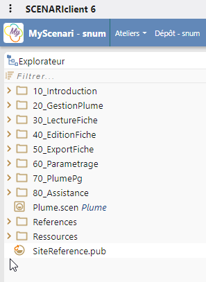

2. Mettre à jour la date du document, et toute autre métadonnée nécessitant d'être actualisée.

    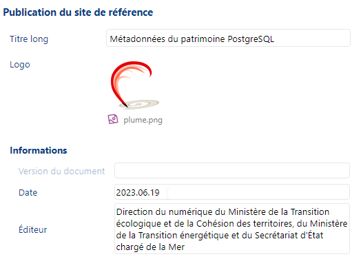

3. Cliquer sur le bouton *Ctrl* pour vérifier que tous les liens internes et externes sont valides.

    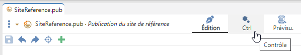

4. En bas du panneau de gauche, cliquer sur *Publications* pour ouvrir le panneau des publications.

    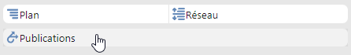

5. Sélectionner *Référence Web* dans l'arborescence, et appuyer sur le bouton *Générer* pour générer une version actualisée de la publication.

    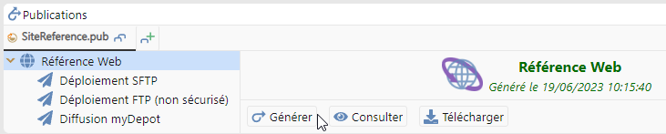

6. Sélectionner *Diffusion myDepot* dans l'arborescence et appuyer sur *Redéployer* pour déployer la documentation actualisée.

    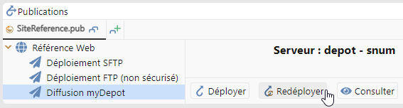

## Rédaction d'une note de version

Pour l'heure, les notes de version sont publiées [dans la documentation technique](./../changelog/changelog.rst).

À chaque nouvelle version correspond un fichier Markdown du répertoire [`docs/changelog`](https://github.com/MTES-MCT/metadata-postgresql/tree/main/docs/changelog) nommé suivant le numéro de la version. Ce fichier doit être référencé dans le sommaire inclus dans [`docs/changelog/changelog.rst`](https://github.com/MTES-MCT/metadata-postgresql/blob/main/docs/changelog/changelog.rst) (juste le nom du fichier, sans l'extension). Les versions y sont ordonnées de la plus récente à la plus ancienne.

Autant que possible, il est souhaitable de conserver une forme homogène entre les notes de versions :
- Le titre est de la forme `Version [nature de la version : majeure, mineure, corrective] [numéro]`. Exemples : *"Version corrective 0.4.1 bêta"*, *"Version majeure 1.0.0"*, *"Version mineure 1.1.0"*.
- L'introduction contient :
    - La date effective de publication de la version. La note de version étant elle-même incluse dans la release, cette information ne peut être renseignée que lorsque la date à laquelle la publication va avoir lieu est certaine.
    - L'URL de la future release donnant accès à la version. Celle-ci est de la forme `https://github.com/MTES-MCT/metadata-postgresql/releases/tag/[tag de la version]`. Cf. [Création d'une `release` sur GitHub](#création-dune-release-sur-github) pour la forme du tag.
    - Un résumé très bref des apports de la version.
    - Si la nouvelle version impose de mettre à jour PlumePg, ou toute autre opération de la part de l'administrateur ou des utilisateurs, un avertissement à ce sujet.
- Si un développement a fait l'objet d'une ou plusieurs issues, la note de version s'y réfère. Elle renvoie aussi vers la documentation utilisateur ou documentation technique d'autant que de besoin.

## Génération et diffusion du paquet Debian PlumePg pour EcoSQL

Si la nouvelle version de Plume inclut une nouvelle version de l'extension PostgreSQL PlumePg, il faudra créer le paquet Debian qui servira notamment à sa diffusion sur les serveurs [EcoSQL](https://spote.developpement-durable.gouv.fr/offre/ecosql-postgresql).

Cf. [Création d'un paquet Debian pour PlumePg](./debian.md) pour la marche à suivre.

## Diffusion de PlumePg sur les serveurs EOLE

Toujours dans le cas d'une nouvelle version de PlumePg, les fichiers (scripts SQL d'installation et mise à jour + fichier `plume_pg.control`) doivent être copiés sur le serveur FTP qui sert à la diffusion des extensions sur les serveurs EOLE du pôle ministériel.

## Génération d'un ZIP du plugin QGIS

L'installation sous QGIS est réalisée à partir d'une archive ZIP du code source, expurgé des modules de tests et autres éléments inutiles pour les utilisateurs.

Cf. [Générer un ZIP propre du plugin](./memo.md#générer-un-zip-propre-du-plugin) pour les commandes à exécuter pour générer cette archive.

## Création d'une release sur GitHub

Créer une *release* de Plume revient à figer le code en l'état ou il se trouve sur la branche principale du dépôt, lui associer un *tag* (étiquette) et mettre à disposition des URL pour le télécharger.

Il est essentiel de ne créer la release qu'une fois l'ensemble du code stabilisé, y compris la documentation et les notes de version. Il ne doit pas non plus y avoir de différence avec le code précédemment utilisé pour générer les fichiers d'installation dans les différents environnements.

Méthode : 
1. Ouvrir la [page des releases](https://github.com/MTES-MCT/metadata-postgresql/releases) du dépôt GitHub. Cette page est également accessible depuis la page d'accueil du dépôt, en cliquant sur *Releases* dans le bandeau de droite.

2. Cliquer sur le bouton *Draft a new release*.

    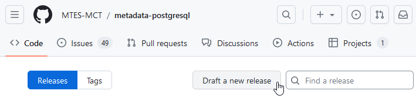

3. Par défaut, la branche cible de la release est la branche principale du dépôt, `main`, et il n'y a généralement pas lieu de la modifier.

4. Cliquer sur *Choose a tag* pour définir le tag / l'étiquette de la version. Le tag est le numéro de la version, précédé d'un "v" minuscule, éventuellement suivi d'un suffixe tel que "-beta" pour une version qui n'est pas destinée à la production.

    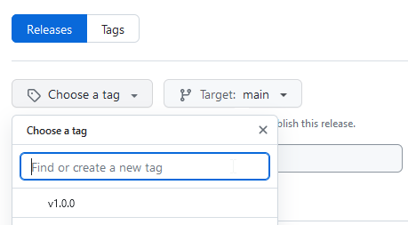

    Le tag n'est pas supposé être présent dans la liste de suggestions, puisqu'il s'agit d'une nouvelle version. Il faudra le saisir dans le champ *Find or create a new tag*, puis cliquer sur *+ Create new tag: vX.X.X on publish* pour valider la création.

    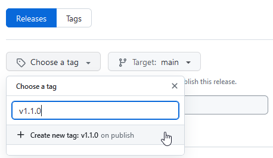

5. Pour une version destinée à la production, le paramétrage par défaut est adapté.

    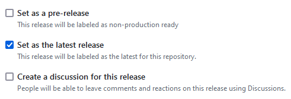
    
    Une version qui ne serait pas destinée à la production devra par contre être marquée comme telle, et la version de référence restera la dernière version de production.

    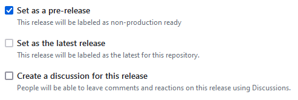

6. Le titre de la release est "Plume v[numéro de version]". Exemple : "Plume v1.1.0", "Plume v0.7 bêta".

    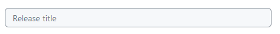

7. Par défaut, deux archives du code source (format ZIP et format TAR.GZ) sont associées à la release. Il faut y ajouter les fichiers utiles à l'installation dans les différents environnements, par un glisser-déposer dans la zone avec la flèche, ou en cliquant sur cette zone pour ouvrir l'explorateur et choisir un fichier.

    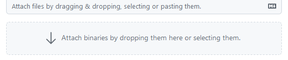

    Fichiers à inclure : 
    - Le ZIP contenant l'archive du plugin Plume destinée à son installation sous QGIS (cf. [Génération d'un ZIP du plugin QGIS](#génération-dun-zip-du-plugin-qgis)).
    - Un ZIP contenant les fichiers de la version de PlumePg correspondante, même si elle n'a pas changé depuis la version précédente.
    - Le ZIP contenant le [paquet](#génération-et-diffusion-du-paquet-debian-plumepg-pour-ecosql) pour l'installation de PlumePg sous Debian.

8. La description a essentiellement deux fonctions : 

    - Renvoyer l'utilisateur vers la documentation et la note de version, où il pourra notamment trouver toutes les informations nécessaires sur la version et les modalités d'installation/mise à jour.
    - Décrire le contenu des fichiers joints à la release, afin que l'utilisateur sache lesquels il doit télécharger.

    Il est judicieux de reprendre la forme des descriptions des releases antérieures.

    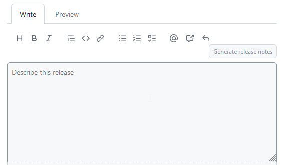

9. Une fois toutes les informations susmentionnées saisies, cliquer sur le bouton vert *Publish release* pour valider la création de la release. Plus aucun retour arrière n'est alors possible.

    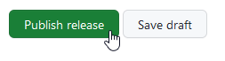

## Diffusion de Plume sur le dépôt des plugin QGIS du pôle ministériel 

Le ZIP d'installation doit être transmis au Groupe socle géomatique (DNUM/MSP/DS/GSG) pour diffusion sur le [dépôt des plugin QGIS du pôle ministériel](http://piece-jointe-carto.developpement-durable.gouv.fr/NAT002/QGIS/plugins/plugins.xml).

## Information des utilisateurs

La dernière étape consiste à informer les utilisateurs de l'existence d'une nouvelle version, au moins via les canaux suivants :
- Mail d'information sur la liste de diffusion labo.postgis.
- Référencement de la version sur la [page *Plume*](https://geoinformations.metier.e2.rie.gouv.fr/plume-a3818.html) de l'intranet GéoInformations.

