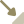

# Actions générales

Sont décrites ici les actions que l'utilisateur peut réaliser dans la partie fixe de l'interface du plugin. Pour les interactions de l'utilisateur avec les widgets du formulaire de saisie (ajout/suppression de valeurs, etc.), on se reportera à [Actions contrôlées par les widgets du formulaire](./actions_widgets.md).

Barre d'outils de Plume : [Mode lecture, mode édition](#mode-lecture-mode-édition) • [Sauvegarde](#sauvegarde) • [Activation du mode traduction](#activation-du-mode-traduction) • [Choix de la trame de formulaire](#choix-de-la-trame-de-formulaire) • [Langue principale des métadonnées](#langue-principale-des-métadonnées) • [Import de métadonnées](#import-de-métadonnées) • [Export des métadonnées dans un fichier](#export-des-métadonnées-dans-un-fichier) • [Réinitialisation](#réinitialisation) • [Copier / coller d'une fiche complète](#copier--coller-dune-fiche-complète)

Détail des fonctionnalités d'import : [Import de métadonnées depuis un fichier (DCAT)](#import-de-métadonnées-depuis-un-fichier-dcat) • [Import de métadonnées depuis un service CSW (INSPIRE)](#import-de-métadonnées-depuis-un-service-csw-inspire) • [Import de métadonnées depuis un fichier (INSPIRE)](#import-de-métadonnées-depuis-un-fichier-inspire)

Autres actions : [Sélection de la table à documenter](#sélection-de-la-table-à-documenter)

*Voir aussi : [Gestion de *PlumePg* via Plume](./gestion_plume_pg.md#gestion-de-plumepg-via-plume) • [Gestion des modèles via Plume](./modeles_de_formulaire.md#gestion-des-modèles-via-plume)*

## Mode lecture, mode édition

### Effet sur le formulaire

Une fiche de métadonnées peut être ouverte :
- soit en **mode lecture**, qui permet de consulter les métadonnées mais pas de les modifier ;
- soit en **mode édition**, qui permet de modifier les métadonnées.

Du point de vue de l'utilisateur, le formulaire paraîtra très différent dans les deux modes. En mode lecture, tous les widgets de saisie sont désactivés (la [clé `'read only'`](./creation_widgets.md#paramètres-spécifiques-aux-widgets-de-saisie) du dictionnaire de widgets vaut toujours `True`). De plus, là où le mode édition affiche naturellement les champs sans valeur pour que l'utilisateur puisse les remplir, le mode lecture les masque[^readhideblank].

[^readhideblank]: Sauf si l'utilisateur a explicitement demandé le contraire en mettant à `False` le paramètre utilisateur [`readHideBlank`](./generation_dictionnaire_widgets.md#readhideblank) - cf. [Paramètres utilisateur](./parametres_utilisateur.md).

Concrètement, le passage d'un mode à l'autre implique simplement de [regénérer le dictionnaire de widgets](./generation_dictionnaire_widgets.md) en spécifiant le mode grâce au paramètre [`mode`](./generation_dictionnaire_widgets.md#mode) du constructeur de la classe `plume.rdf.widgetsdict.WidgetsDict` :
- `mode='edit'` en mode édition ;
- `mode='read'` en mode lecture.

Le formulaire de saisie/consultation peut ensuite être [recréé à partir du nouveau dictionnaire](./creation_widgets.md), selon les mêmes modalités quel que soit le mode.

### Autres effets

Certaines des actions générales décrites dans la suite ne devraient être disponibles qu'en mode édition :
- la sauvegarde des modifications ;
- l'activation ou la désactivation du mode traduction ;
- l'import de métadonnées depuis un fichier ;
- la réinitialisation de la fiche.

### Caractéristiques du bouton

**Initialement, toutes les fiches s'ouvrent en mode lecture**. L'utilisateur doit cliquer sur le bouton d'activation du mode édition pour basculer dans ce dernier.

Le bouton utilise l'icône [read.svg](../../plume/icons/general/read.svg) :
.

L'idéal serait que le texte d'aide s'adapte au mode courant :

| Mode actif | Condition | Infobulle |
| --- | --- | --- |
| lecture | `if mode == 'read'` | *Basculer en mode édition.* |
| édition | `if mode == 'edit'` | *Quitter le mode édition. Attention : les modifications non enregistrées seront perdues.* |

Le bouton devra être inactif quand l'utilisateur ne dispose pas des droits nécessaires pour éditer les métadonnées de la table ou vue considérée, soit quand son rôle de connexion n'est pas membre du rôle propriétaire de l'objet.

Pour s'en assurer, on utilisera la requête définie par la fonction `plume.pg.queries.query_is_relation_owner`.

```python

import psycopg2
from plume.pg import queries

conn = psycopg2.connect(connection_string)

with conn:
	with conn.cursor() as cur:
	
		cur.execute(
			*queries.query_is_relation_owner(schema_name, table_name)
			)
		res = cur.fetchone()
		is_owner = res[0] if res else False

conn.close()

```

*`connection_string` est la chaîne de connexion à la base de données PostgreSQL, `table_name` est le nom de la table ou vue dont on affiche les métadonnées, `schema_name` est le nom de son schéma.*

Lorsque l'utilisateur désactive le mode édition sans avoir sauvegardé, une boîte de dialogue apparaît pour lui demander de confirmer (en le prévenant que ses modifications seront alors perdues) ou d'annuler. Ce comportement pouvant vite devenir lassant, un paramètre utilisateur devra permettre d'inhiber l'affichage de ces messages.

Il n'est pas possible d'établir de manière certaine si les métadonnées ont réellement été modifiées, mais on pourra épargner à l'utilisateur l'étape de confirmation quand aucune des conditions ci-après n'est remplie, puisqu'il est alors certain qu'il n'y a aucun changement :
1. Parmi les clés du dictionnaire de widgets correspondant à des widgets de saisie, il en existe au moins une telle que la valeur saisie dans le widget est différente de celle contenue dans la clé `'value'` du dictionnaire interne.
2. L'attribut `modified` du dictionnaire de widgets vaut `True`. Cet attribut, qui vaut toujours `False` à l'initialisation du dictionnaire de widgets, est mis à `True` par toutes les méthodes de manipulation des clés (ajout, suppression, changement de langue, changement d'unité, intégration de valeur calculée...). Il est susceptible de créer des faux positifs : par exemple, ce n'est pas parce qu'une clé est ajoutée dans un groupe de valeurs qu'une valeur y sera effectivement saisie.
3. L'attribut `rewritten` du graphe de métadonnées (l'argument `metagraph` de `plume.rdf.widgetsdict.WidgetsDict`) vaut `True`. Ce sera le cas si et seulement si le graphe a été généré par import depuis une source externe, copier/coller d'une fiche de métadonnées ou réinitialisation, c'est-à-dire tous les procédés qui produisent un graphe a priori non cohérent avec les métadonnées stockées sur le serveur PostgreSQL.

## Sauvegarde

### Effets

Le **bouton de sauvegarde** permet à l'utilisateur d'enregistrer sur le serveur PostgreSQL les métadonnées qu'il a saisies.

En arrière plan, cela suppose plusieurs opérations successives.

1. Enregistrer dans le dictionnaire de widgets les valeurs contenues dans les widgets de saisie. On utilisera pour ce faire la méthode `update_value` de la classe `plume.rdf.widgetsdict.WidgetsDict`.

Cette opération n'a de sens que pour les widgets de saisie non masqués, néanmoins la méthode `plume.rdf.widgetkey.RootKey.build_metagraph`[^appel-roootkey-build-metagraph], qui assure ensuite la reconstruction du graphe de métadonnées mis à jour, se charge d'éliminer les clés masquées. On pourra donc simplement boucler sur toutes les clés du dictionnaire dont le widget principal est supposé contenir une valeur (pas les boutons ni les groupes, donc) et exécuter :

[^appel-roootkey-build-metagraph]: Cette méthode est appelée par la méthode `build_metagraph` de `plume.rdf.widgetsdict.WidgetsDict` utilisée à l'étape suivante.

```python

widgetsdict.update_value(widgetkey, widget_value)

```
*Où `widgetkey` est une clé du dictionnaire de widgets `widgetsdict` correspondant à un widget de saisie et `widget_value` la valeur récupérée dans ce widget.*


2. Générer un graphe de métadonnées à partir du dictionnaire de widgets actualisé.

```python

new_metagraph = widgetsdict.build_metagraph()

```

3. Créer une version actualisée du descriptif PostgreSQL de l'objet.

Le descriptif, objet de classe [`plume.pg.description.PgDescription`](./generation_dictionnaire_widgets.md#metagraph--le-graphe-des-métadonnées-pré-existantes) nommé ci-après `pg_description`, est mis à jour via sa propriété `metagraph`.

```python

pg_description.metagraph = new_metagraph

```

4. Envoyer au serveur PostgreSQL une requête de mise à jour du descriptif.

On utilisera la requête définie par la fonction `query_update_table_comment` du module `plume.pg.queries`. À noter que, dans la mesure où les commandes diffèrent selon le type de relation, il est nécessaire de commencer par récupérer cette information avec `query_get_relation_kind`.

Pour le descriptif, on s'assurera d'utiliser `str(pg_description)`, qui renvoie une représentation sous forme de chaîne de caractères de `pg_description`.

```python

import psycopg2
from plume.pg import queries

conn = psycopg2.connect(connection_string)

with conn:
    with conn.cursor() as cur:

        cur.execute(
            *pg_queries.query_get_relation_kind(
                schema_name, table_name
                )
            )
        kind = cur.fetchone()
        
        query = pg_queries.query_update_table_comment(
            schema_name, table_name, relation_kind=kind[0],
            str(pg_description)
            )
        cur.execute(*query)

conn.close()

```

*`connection_string` est la chaîne de connexion à la base de données PostgreSQL, `table_name` est le nom de la table ou vue dont on édite les métadonnées, `schema_name` est le nom de son schéma.*

5. Mettre à jour les descriptifs des champs.

La requête de mise à jour est directement déduite du dictionnaire de widgets par la fonction `query_update_columns_comments` du module `plume.pg.queries`.

```python

import psycopg2
from plume.pg import queries

conn = psycopg2.connect(connection_string)

with conn:
	with conn.cursor() as cur:
	
        query = pg_queries.query_update_columns_comments(
            schema_name, table_name, widgetsdict
            )
        
        if query:
            cur.execute(*query)

conn.close()

```

*`connection_string` est la chaîne de connexion à la base de données PostgreSQL, `table_name` est le nom de la table ou vue dont on édite les métadonnées, `schema_name` est le nom de son schéma.*

*La condition de non nullité sur `query` est nécessaire, car la fonction pourrait renvoyer `None` si le dictionnaire ne contenait aucun descriptif de champs. Ceci peut arriver :*
- *si le paramètre [`columns`](./generation_dictionnaire_widgets.md#columns--les-descriptifs-des-champs) n'a pas été fourni en argument lors de la création du dictionnaire de widgets ;*
- *ou si cette liste était vide, parce que la table n'a aucun champ.*

### Caractéristiques du bouton

Comme susmentionné, ce bouton ne doit être actif qu'en [mode édition](#mode-lecture-mode-édition).

Il utilise l'icône [save.svg](../../plume/icons/general/save.svg) :


Texte d'aide : *Enregistrer les métadonnées*.

## Activation du mode traduction

### Effets

Lorsque le mode traduction est actif, l'utilisateur a la possibilité de définir la langue des valeurs qu'il saisit (sinon c'est le paramètre utilisateur [`language`](./generation_dictionnaire_widgets.md#language) qui est systématiquement utilisé). Il pourra également saisir des traductions pour des catégories qui n'acceptent qu'une valeur par langue, comme le libellé de la donnée.

Concrètement, l'activation ou la désactivation du mode traduction impliquera de [regénérer le dictionnaire de widgets](./generation_dictionnaire_widgets.md) avec la valeur adéquate pour le paramètre [`translation`](./generation_dictionnaire_widgets.md#translation) du constructeur de la classe `plume.rdf.widgetsdict.WidgetsDict` :
- `translation=True` si le mode traduction est actif ;
- `translation=False` s'il ne l'est pas.

Le formulaire de saisie/consultation peut ensuite être [recréé à partir du nouveau dictionnaire](./creation_widgets.md), selon les mêmes modalités que le mode traduction soit actif ou non.

### Caractéristiques du bouton

Ce bouton ne doit être actif qu'en [mode édition](#mode-lecture-mode-édition).

Il utilise l'icône [translation.svg](../../plume/icons/general/translation.svg) :


L'idéal serait que le texte d'aide s'adapte selon que le mode traduction est actif ou non :

| Mode traduction activé | Condition | Infobulle |
| --- | --- | --- |
| non | `if not translation` | *Activer les fonctions de traduction* |
| oui | `if translation` | *Désactiver les fonctions de traduction* |

[Comme pour le passage du mode édition au mode lecture](#caractéristiques-du-bouton), l'utilisateur devra être averti qu'il risque de perdre les changements non enregistrés lorsqu'il active ou désactive le mode traduction. Seule différence, la troisième condition d'apparition (attribut `plume.rdf.metagraph.Metagraph.rewritten` valant `True`) ne s'applique pas ici, car le nouveau dictionnaire de widgets peut sans problème être généré à partir du graphe "réécrit", pour permettre à l'utilisateur de mieux contrôler le résultat avant de décider s'il souhaite le sauvegarder.

### Initialisation

Ce paramètre pourra être systématiquement sauvegardé dans le fichier `QGIS3.ini`, et initialisé à l'activation du mode édition à partir de la valeur récupérée dans les fichiers de configuration (ou `False` à défaut).


## Choix de la trame de formulaire

### Effets

Le modèle de formulaire détermine les catégories de métadonnées affichées dans le formulaire et la manière dont elles sont présentées - cf. [Modèles de formulaire](./modeles_de_formulaire.md).

Dès lors que des modèles sont disponibles, c'est-à-dire que [`templateLabels`](./modeles_de_formulaire.md#récupération-de-la-liste-des-modèles) n'est pas `None` ou une liste vide, l'utilisateur doit avoir la possibilité de basculer à tout moment d'un modèle pré-défini à l'autre ou de ne pas appliquer de modèle du tout.

Lorsque l'utilisateur change de modèle, il faut [regénérer le dictionnaire de widgets](./generation_dictionnaire_widgets.md) avec la valeur adaptée pour le paramètre [`template`](./#template--le-modèle-de-formulaire) du constructeur de la classe `plume.rdf.widgetsdict.WidgetsDict` :
- `None` quand l'utilisateur a choisi l'option `'Aucun'` ;
- l'objet `plume.pg.template.TemplateDict` généré à partir du nom du modèle sélectionné (`tpl_label`) en suivant la méthode décrite dans [Modèles de formulaire](./modeles_de_formulaire.md#récupération-de-la-liste-des-modèles) (étape [Récupération des catégories associées au modèle retenu](./modeles_de_formulaire.md#récupération-des-catégories-associées-au-modèle-retenu) et suivantes).

Le formulaire de saisie/consultation peut ensuite être [recréé à partir du nouveau dictionnaire](./creation_widgets.md), selon les mêmes modalités quel que soit le modèle.

### Caractéristiques du widget

Le widget de sélection du modèle est un `QToolButton` similaire aux [boutons de sélection de la source](./creation_widgets.md#widget-annexe--bouton-de-sélection-de-la-source) qui apparaissent dans le formulaire.

Les valeurs disponibles dans son menu sont les noms de modèles listés par [`templateLabels`](./modeles_de_formulaire.md#récupération-de-la-liste-des-modèles), auxquelles ont ajoutera un item `'Aucun'` (ou autre nom similaire).

Si `templateLabels` est `None` ou une liste vide, on pourra désactiver le widget, voire ne pas l'afficher. `template` vaudra simplement toujours `None`.

D'autant que de besoin, le bouton utilise l'icône [template.svg](../../plume/icons/general/template.svg) :
.

Le nom du modèle courant est affiché à côté de l'icône. Dans le menu, il est mis en évidence par l'icône [selected_brown.svg](../../plume/icons/general/selected_brown.svg) :
.

Texte d'aide : *Choisir un modèle de formulaire*.

Lorsque le mode édition est actif, et uniquement dans ce cas[^chgtauto], l'utilisateur devra être averti qu'il risque de perdre ses modifications non enregistrées en cliquant sur ce bouton. Ces avertissements sont gérés de la même manière que pour la [(dés)activation du mode traduction](#activation-du-mode-traduction).

[^chgtauto]: Il peut arriver que le dictionnaire de widgets soit modifié en mode lecture, notamment dans le cas où le modèle de fiche de métadonnées utilisé prévoit le calcul automatique de certaines informations. Cependant il n'est pas pertinent d'avertir l'utilisateur dans ce cas, considérant qu'il n'a pas la possibilité de sauvegarder les changements tant qu'il est en mode lecture.

### Initialisation

La démarche à suivre à l'ouverture d'une fiche de métadonnées est décrite dans [Modèles de formulaire](./modeles_de_formulaire.md#import-par-le-plugin). On commencera par récupérer les paramètres `preferedTemplate` et `enforcePreferedTemplate` dans les fichiers de configuration, si tant est qu'ils soient présents.


## Langue principale des métadonnées

### Effets

La langue principale des métadonnées correspond au paramètre [`language`](./generation_dictionnaire_widgets.md#language) du constructeur de la classe `plume.rdf.widgetsdict.WidgetsDict`.

Hors mode traduction, toutes les métadonnées saisies qui ne soient pas des dates, nombres, URL ou autres types indépendants de la langue seront présumées être dans cette langue. C'est aussi dans cette langue que seront affichées les valeurs issues des thésaurus (autant que possible, car les thésaurus ne contiennent pas de traductions pour toutes les langues imaginables).

Lorsque l'utilisateur modifie la langue principale, il est nécessaire de [regénérer le dictionnaire de widgets](./generation_dictionnaire_widgets.md) avec la nouvelle valeur de `language`. Le formulaire de saisie/consultation peut ensuite être [recréé à partir du nouveau dictionnaire](./creation_widgets.md), selon les mêmes modalités quel que soit la langue.

### Caractéristiques du widget

Le widget de choix de la langue principale est un `QToolButton` similaire aux [boutons de sélection de la langue](./creation_widgets.md#widget-annexe--bouton-de-sélection-de-la-langue) affichés dans le formulaire. Les valeurs disponibles dans le menu sont les langues listées par le paramètre utilisateur [`langList`](./generation_dictionnaire_widgets.md#langlist).

Le code de la langue courante est affiché sur le bouton (pas d'icône). Dans le menu, il est mis en évidence par l'icône [selected_brown.svg](../../plume/icons/general/selected_brown.svg) :
.

Texte d'aide : *Modifier la langue principale des métadonnées*.

Lorsque le mode édition est actif, et uniquement dans ce cas[^chgtauto], l'utilisateur devra être averti qu'il risque de perdre ses modifications non enregistrées en cliquant sur ce bouton. Ces avertissements sont gérés de la même manière que pour la [(dés)activation du mode traduction](#activation-du-mode-traduction).

### Initialisation

Le paramètre `language` pourra être systématiquement sauvegardé dans le fichier `QGIS3.ini`, et initialisé à l'activation du plugin à partir de la valeur récupérée dans les fichiers de configuration.

Un point important est que `language` doit toujours être l'une des langues listées par le paramètre utilisateur `langList`. Si ce n'est pas le cas avec les valeurs issues des fichiers de configuration, on pourra soit ajouter `language` à `langList`, soit choisir pour `language` une des valeurs effectives de `langList` (sous réserve que ce dernier soit renseigné). Et si aucun de ces paramètres n'est défini, on pourra utiliser les mêmes valeurs par défaut que celles du constructeur de `plume.rdf.widgetsdict.WidgetsDict`, à savoir `'fr'` pour `language` et `['fr', 'en']` pour `langList`. 


## Import de métadonnées

Le bouton d'import de métadonnées depuis des sources externes n'est actif qu'en mode édition.

Il s'agit d'un `QToolButton` dont le menu contient à ce jour trois items, correspondant aux trois sources possibles :
- `Importer depuis un fichier (DCAT)` ;
- `Importer depuis un fichier (INSPIRE)` ;
- `Importer depuis un service CSW (INSPIRE)`.

Leur effet est décrit ci-après.

Le bouton utilise l'icône [import.svg](../../plume/icons/general/import.svg) :


Texte d'aide : *Importer les métadonnées depuis un fichier ou un service CSW*.

### Import de métadonnées depuis un fichier (DCAT)

Cette fonctionnalité permet de remplacer les métadonnées de la table ou vue considérée par des métadonnées importées depuis un fichier. L'import ne fonctionnera que si les métadonnées sont encodées dans un format RDF et il ne donnera un résulat concluant que si elles respectent les profils DCAT-AP, GeoDCAT-AP, ou le profil GeoDCAT-AP étendu mis en oeuvre par le plugin.

L'import est réalisé via la fonction `plume.rdf.metagraph.metagraph_from_file` :

```python

from plume.rdf.metagraph import metagraph_from_file

try:
    metagraph = metagraph_from_file(filepath, format=format, old_metagraph=old_metagraph)
except:
    # notamment si ce n'était pas du RDF 
    ...

```

*`filepath` est le chemin complet du fichier source, `format` est le format RDF des métadonnées qu'il contient. Ces deux paramètres sont à spécifier par l'utilisateur. `old_metagraph` est l'ancien graphe de métadonnées de la table, soit le `metagraph` actuel, dont la fonction récupère l'identifiant.*

Si le format n'est pas déterminé, la fonction est généralement capable de le déduire de l'extension du fichier (sinon elle renverra une erreur). Il serait donc admissible de ne pas le demander et se contenter de :

```python

from plume.rdf.metagraph import metagraph_from_file

try:
    metagraph = metagraph_from_file(filepath, old_metagraph=old_metagraph)
except:
    # notamment si ce n'était pas du RDF ou
    # si le format n'a pas pu être deviné
    ...

```

Il faudra ensuite [regénérer le dictionnaire de widgets](./generation_dictionnaire_widgets.md) avec le nouveau graphe de métadonnées ainsi obtenu comme valeur pour le paramètre [`metagraph`](./generation_dictionnaire_widgets.md#metagraph--le-graphe-des-métadonnées-pré-existantes) du constructeur de `plume.rdf.widgetsdict.WidgetsDict`. Le formulaire de saisie/consultation peut ensuite être [recréé à partir du nouveau dictionnaire](./creation_widgets.md).

La liste des formats autorisés est obtenue ainsi :

```python

from plume.rdf.utils import import_formats

importFormats = import_formats()

```

Pour avoir la liste des extensions correspondant à un format donné :

```python

from plume.rdf.utils import import_extensions_from_format

extensions = import_extensions_from_format(format)

```

Pour avoir la liste de toutes les extensions reconnues :

```python

from plume.rdf.utils import import_extensions_from_format

extensions = import_extensions_from_format()

```

### Import de métadonnées depuis un service CSW (INSPIRE)

Cette fonctionnalité permet de remplacer les métadonnées de la table ou vue considérée par des métadonnées importées par requête sur le service CSW d'un catalogue INSPIRE, comme GéoIDE ou une plateforme régionale.

Son activation par l'utilisateur ouvre une boîte de dialogue dans laquelle s'effectue le paramétrage de l'import.

| Paramètre | Description | Mode de saisie |
| --- | --- | --- |
| `url_csw` | URL de base du service CSW | Ligne de saisie libre. Il serait intéressant de permettre à l'utilisateur de mémoriser les URL qu'il saisit dans un paramètre [`urlCsw`](./parametres_utilisateur.md) sauvegardé dans le fichier `QGIS3.ini`, afin qu'il n'ait pas à les réécrire à chaque import. La fenêtre de paramétrage lui permettrait de choisir entre l'une des URL de sa liste ou une nouvelle URL ajoutée manuellement, qu'il pourra ensuite enregistrer s'il le souhaite. |
| `file_identifier` | Identifiant de la fiche de métadonnées | Ligne de saisie libre. |
| `preserve` | Mode de fusion du graphe de métadonnées actuel avec les métadonnées importées | Trois boutons radio correspondant aux trois modes d'import possibles. |
| `save_configuration` | La configuration d'import (URL du CSW et identifiant de la fiche) doit-elle être mémorisée dans les métadonnées ? | Case à cocher. Cochée par défaut. Libellé : *Enregistrer la configuration dans les métadonnées*. Cette option vise à faciliter d'éventuelles mises à jour ultérieures à partir de la même source distante. |

Les modes d'import sont les suivants :

| Valeur de `preserve` | Etiquette du bouton radio |
| --- | --- |
| `'always'` | Compléter avec les métadonnées distantes |
| `'if blank'` | Mettre à jour avec les métadonnées distantes |
| `'never'` | Remplacer par les métadonnées distantes |

Par défaut, l'option `Compléter avec les métadonnées distantes` est sélectionnée.

À l'ouverture de la fiche de métadonnées, on tentera de de récupérer les valeurs des paramètres `url_csw` et `file_identifier` dans le graphe de métadonnées :

```python

url_csw, file_identifier = old_metagraph.linked_record

```

*`old_metagraph` est l'ancien graphe de métadonnées de la table, c'est-à-dire le `metagraph` courant au moment de l'ouverture de la fenêtre d'import.*

En pratique cette propriété `plume.rdf.metagraph.Metagraph.linked_record` interroge le graphe à la recherche des valeurs éventuelles de `plume:linkedRecord / dcat:endpointURL` et
`plume:linkedRecord / dct:identifier`. Ce sont des métadonnées comme les autres, qui peuvent tout à fait être éditées via le formulaire de Plume.

Une fois son paramétrage réalisé, l'utilise clique sur un bouton `Import`, ce qui lance une procédure en cinq temps :

1. Création de la requête, avec `plume.iso.csw.getrecordbyid_request`.

```python

from plume.iso.csw import getrecordbyid_request

request = getrecordbyid_request(url_csw, file_identifier)

```

2. Envoi de la requête au CSW, par exemple avec `qgis.core.QgsNetworkContentFetcher`.

3. Génération du nouveau graphe de métadonnées.

```python

from plume.rdf.metagraph import metagraph_from_iso

metagraph = metagraph_from_iso(raw_xml, old_metagraph=old_metagraph, preserve=preserve)

```

*`old_metagraph` est l'ancien graphe de métadonnées de la table, c'est-à-dire le `metagraph` courant au moment de l'ouverture de la fenêtre d'import.`raw_xml` est la réponse du CSW, sous forme de chaîne de caractères.*

Les métadonnées ISO 19115/19139 importées sont restructurées selon les catégories de métadonnées communes de Plume. Pour l'heure, ce n'est pas exhaustif. Seules les informations suivantes sont récupérées :
- libellé ;
- description ;
- référentiel(s) de coordonnées ;
- date de création ;
- date de dernière modification ;
- date de publication ;
- mots clés libres ;
- thème INSPIRE ;
- catégorie thématique ISO 19115 ;
- généalogie ;
- organisations responsables, avec leur rôle, leur nom, leur numéro de téléphone, leur adresse mél, leur site internet.

Il est également possible que, même pour les catégories susmentionnées, une partie des métadonnées de certains catalogues ne soient pas reconnues. Tous les catalogues n'ont pas interprété les standard ISO de la même façon et la même information peut avoir un emplacement différent selon les cas. À ce stade, les tests réalisés ont porté sur des fiches de métadonnées issues de GéoIDE, d'un catalogue Prodige et d'un catalogue Géosource.

4. Mémorisation éventuelle de la configuration d'import

Si l'utilisateur n'a pas décoché la case à cocher `save_configuration`, on utilise la propriété `linked_record` pour mémoriser `url_csw` et `file_identifier` dans le nouveau graphe de métadonnées.

```python

if save_configuration:
    metagraph.linked_record = url_csw, file_identifier

```

5. Comme toujours, il faudra ensuite [regénérer le dictionnaire de widgets](./generation_dictionnaire_widgets.md) avec le nouveau graphe de métadonnées ainsi obtenu comme valeur pour le paramètre [`metagraph`](./generation_dictionnaire_widgets.md#metagraph--le-graphe-des-métadonnées-pré-existantes) du constructeur de `plume.rdf.widgetsdict.WidgetsDict`. Le formulaire de saisie/consultation peut ensuite être [recréé à partir du nouveau dictionnaire](./creation_widgets.md).

### Import de métadonnées depuis un fichier (INSPIRE)

Comme l'import depuis un service CSW, ce mode d'import gère des métadonnées INSPIRE, mais mises à disposition sous la forme d'un fichier XML. Du point de vue de l'interface, le fonctionnement est donc très proche de l'[import depuis un fichier DCAT](#import-de-métadonnées-depuis-un-fichier-dcat), tandis que le traitement aval est identique à celui de l'[import depuis un service CSW](#import-de-métadonnées-depuis-un-service-csw-inspire).

L'import est réalisé via la fonction `plume.rdf.metagraph.metagraph_from_iso_file` :

```python

from plume.rdf.metagraph import metagraph_from_iso_file

try:
    metagraph = metagraph_from_iso_file(filepath, old_metagraph=old_metagraph)
except:
    # par exemple si le chemin ne pointe pas sur un fichier 
    ...

```

*`filepath` est le chemin complet du fichier source, à spécifier par l'utilisateur. `old_metagraph` est l'ancien graphe de métadonnées de la table, soit le `metagraph` actuel, dont la fonction récupère l'identifiant.*

*NB. La fonction `plume.rdf.metagraph.metagraph_from_iso_file` admet également le même paramètre `preserve` que `plume.rdf.metagraph.metagraph_from_iso` - cf. [Import de métadonnées depuis un service CSW (INSPIRE)](#import-de-métadonnées-depuis-un-service-csw-inspire) - mais il est plutôt proposé à ce stade de conserver le même comportement pour toutes les fonctionnalités d'import depuis un fichier, à savoir le remplacement complet de la fiche. C'est ce que fait nativement `plume.rdf.metagraph.metagraph_from_iso_file` (valeur par défaut `'never'` pour `preserve`).*

On attend a priori un fichier d'extension `.xml`, donc la boîte de dialogue de sélection du fichier pourrait filtrer sur cette extension à l'ouverture, tout en laissant aussi à l'utilisateur la possibilité d'afficher tous les fichiers.

Il faudra ensuite [regénérer le dictionnaire de widgets](./generation_dictionnaire_widgets.md) avec le nouveau graphe de métadonnées ainsi obtenu comme valeur pour le paramètre [`metagraph`](./generation_dictionnaire_widgets.md#metagraph--le-graphe-des-métadonnées-pré-existantes) du constructeur de `plume.rdf.widgetsdict.WidgetsDict`. Le formulaire de saisie/consultation peut ensuite être [recréé à partir du nouveau dictionnaire](./creation_widgets.md).

## Export des métadonnées dans un fichier

### Effets

Cette fonctionnalité permet d'exporter une sérialisation RDF de `metagraph` dans un fichier.

Elle fait appel à la méthode `export` de la classe `plume.rdf.metagraph.Metagraph`.

```python

try:
    metagraph.export(filepath, format)
except:
    ...

```

*`metagraph` est le graphe des métadonnées (cf. [Génération du dictionnaire des widgets](./generation_dictionnaire_widgets.md#metagraph--le-graphe-des-métadonnées-pré-existantes)), `filepath` est le chemin complet du fichier de destination, `format` est le format RDF d'export. Les deux derniers paramètres sont à spécifier par l'utilisateur.*

Le contrôle d'erreur n'est pas absolument essentiel ici, car les graphes de métadonnées de Plume sont très simples et présumés compatibles avec les fonctions d'export de RDFLib. Néanmoins l'expérience a montré que certains formats réagissaient mal aux URI basés sur des URN, par exemple. On préférera donc être prudent. Un échec à l'export ne mérite pas un plantage du plugin.

C'est bien `metagraph` qui est exporté et non le contenu (potentiellement non sauvegardé) du formulaire.

### Caractéristiques du bouton

Ce bouton utilise l'icône [export.svg](../../plume/icons/general/export.svg) :


Texte d'aide : *Exporter les métadonnées dans un fichier*.

Une implémentation possible serait d'utiliser un `QToolButton` avec un menu listant les formats autorisés. Ceux-ci varient selon le contenu de `metagraph`. Pour obtenir la liste, on utilisera la propriété `available_formats` du graphe de métadonnées :

```python

exportFormats = metagraph.available_formats

```

Pour connaître l'extension associée par défaut à un format :

```python

from plume.rdf.utils import export_extension_from_format

extension = export_extension_from_format(format)

```

## Réinitialisation

### Effets

Cette fonctionnalité permet de remplacer les métadonnées de la table ou vue considérée par un graphe vide.

On utilisera la commande suivante :

```python

from plume.rdf.metagraph import copy_metagraph

metagraph = copy_metagraph(old_metagraph=old_metagraph)

```
*`old_metagraph` est l'ancien graphe de métadonnées de la table, soit le `metagraph` actuel, dont la fonction conserve l'identifiant.*

Il faudra ensuite [regénérer le dictionnaire de widgets](./generation_dictionnaire_widgets.md) avec le nouveau graphe de métadonnées ainsi obtenu comme valeur pour le paramètre [`metagraph`](./generation_dictionnaire_widgets.md#metagraph--le-graphe-des-métadonnées-pré-existantes) du constructeur de `plume.rdf.widgetsdict.WidgetsDict`. Le formulaire de saisie/consultation peut ensuite être [recréé à partir du nouveau dictionnaire](./creation_widgets.md).

### Caractéristiques du bouton

Ce bouton ne doit être actif qu'en mode édition.

Il utilise l'icône [empty.svg](../../plume/icons/general/empty.svg) :


Texte d'aide : *Vider la fiche de métadonnées*.


## Copier / coller d'une fiche complète

### Effets

Cette fonctionnalité permet à l'utilisateur de copier l'ensemble des métadonnées renseignées pour une table A vers une autre table B.

Concrètement :
- l'action *Copier* (sur la table A) mémorise le `metagraph` de la table A ;
- l'action *Coller* (sur la table B) régénère le dictionnaire de widgets en utilisant le graphe de mémorisé comme argument [`metagraph`](./generation_dictionnaire_widgets.md#metagraph--le-graphe-des-métadonnées-pré-existantes) du constructeur de `plume.rdf.widgetsdict.WidgetsDict`, puis [re-construit le formulaire](./creation_widgets.md) en conséquence.

Plus précisément, l'argument `metagraph` à fournir au constructeur de `plume.rdf.widgetsdict.WidgetsDict` pour la table B est obtenu via :

```python

from plume.rdf.metagraph import copy_metagraph

metagraph = copy_metagraph(src_metagraph, old_metagraph)

```
*`old_metagraph` est l'ancien graphe de métadonnées de la table B, soit son `metagraph` actuel, dont la fonction conserve l'identifiant. `src_metagraph` est le graphe mémorisé de la table A.*


### Caractéristiques des boutons

Le bouton *Copier* est actif quel que soit le mode.

Icône : 

Texte d'aide : *Copier la fiche de métadonnées*.

Le bouton *Coller* n'est actif qu'en mode édition et si un graphe a été préalablement mémorisé.

Icône : 

Texte d'aide : *Coller la fiche de métadonnées mémorisée*.


## Sélection de la table à documenter

Au contraire de toutes les actions précédemment décrites, la sélection de la table ou vue dont l'utilisateur souhaite éditer les métadonnées se fait hors de l'interface du plugin, dans le panneau explorateur, le panneau des couches ou encore le panneau d'AsgardMenu.

### Si aucun objet n'est sélectionné

... il n'y a évidemment pas de métadonnées à afficher.

En principe, cette situation ne devrait se produire qu'à l'ouverture du plugin, lorsque l'utilisateur n'a pas préalablement cliqué sur une table ou vue dans l'un des panneaux pour la sélectionner.

Dans ce cas, on lui montre une interface vide, avec uniquement la barre de menus.

Les seuls boutons actifs sont alors :
- le bouton de choix du modèle ;
- le bouton de sélection de la langue principale ;
- le bouton de configuration de l'interface ;
- le bouton d'aide.

### Quand l'utilisateur sélectionne un nouvel objet

**Définir une nouvelle table source ne doit être possible qu'en mode lecture.** Il est important que l'utilisateur ne perde pas involontairement toutes ses modifications en cours à cause d'un clic malencontreux dans l'explorateur... Il n'est bien sûr pas question d'empêcher l'utilisateur de sélectionner des objets dans les panneaux de QGIS, mais le plugin ne devra pas le prendre en compte tant que le mode édition reste actif.

Lorsqu'une nouvelle tables ou vue est sélectionnée, le plugin devra d'abord extraire les métadonnées contenues dans son descriptif PostgreSQL - cf. [metagraph : le graphe des métadonnées pré-existantes](./generation_dictionnaire_widgets.md#metagraph--le-graphe-des-métadonnées-pré-existantes). Il faudra ensuite régénérer le dictionnaire de widgets avec le nouveau graphe de métadonnées `metagraph` ainsi obtenu (cf. [Génération du dictionnaire des widgets](./generation_dictionnaire_widgets.md)), puis le formulaire à partir du dictionnaire de widgets mis à jour (cf. [Création d'un nouveau widget](./creation_widgets.md)).


