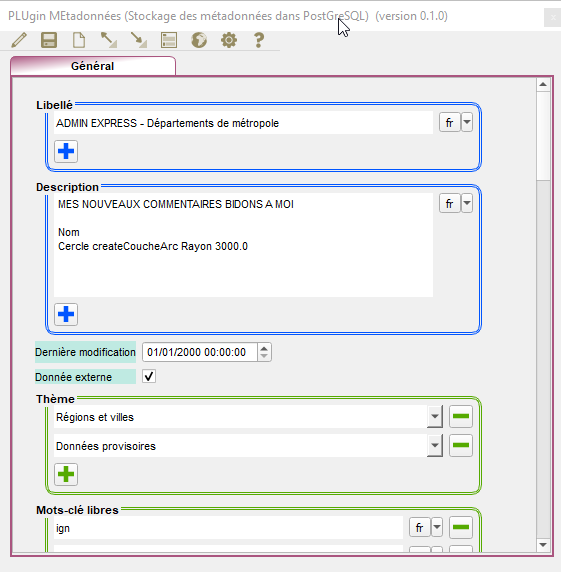

# PLUGIN QGIS PLUME
> Plugin pour QGIS, PLUgin MEtadonnées est destiné aux administrateurs de données, pour saisir les métadonnées dse leur patrimoine soue PostgreSQL / PostGIS.

---           
## version
- [0.1.0]

---           

## Technologies
- [Python 3.x]

---           

## Environnement
 - Version de QGIS 3.20.2 -Odense (fonctionne en 3.x)
 - Qt 5.15.2 
 - OS Version Windows 10 (10.0)

---

## Installation
### Automatiquement
L’application se trouve sur la ressource du département MSP/DS/GSG (http://piece-jointe-carto.developpement-durable.gouv.fr/NAT002/QGIS/plugins/plugins.xml)
et est donc accessible via le menu Extension : Installer / Gérer les extensions.
PLUME pourra être installé, mis à jour via ce dispositif.

### Manuellement
Procédez via le menu Extension : Installer / Gérer les extensions / item 'Installer depuis un zip'


---

## Documentation
La documentation sous scenari au format dokiel [est disponible ici](https://snum.scenari-community.org/Asgard/Documentation/#SEC_AsgardManager).

### Flyers




---

## Structure des fichiers
```bash
.                        # `Racine où se trouve les sources .py`
│
├── i18n                 # `fichiers des langues
└── icons                # `icones de l'application, menu, barre d'outils, IHM`
    └── generale         # `icones générales`
    └── buttons          # `icones des boutons générés à la volée`
    └── logo             # `icones dans le menu extension et barre d'outils`
├── bibli_pg             # `bibliothèques des requêtes pour PostgreSQL`
├── bibli_rdf            # `bibliothèques de la génération du dictionnaires`
```
---

## Crédits

### Production

- [Ministère de la Transition Écologique (MTE)
Ministère de la Cohésion des Territoires et des Relations avec les Collectivités Territoriales(MCTRCT) et de la Mer]

  Secrétariat Général  
  Service du Numérique  
  Sous-direction "Usages du Numérique et Innovations"  
  Département "Relation clients"

### Équipe

- Didier LECLERC, concepteur, développeur MTE/MCTRCT SG/SNUM/UNI/DRC
- leslie LEMAIRE, analyse fonctionnelle MTE/MCTRCT SG/SNUM/UNI/DRC

---

## Licence

PLUME (© République Française, 2020-2021) est publié sur le Dépôt interministériel des plugins QGIS sous licence GNU Affero General Public Licence v3.0 ou plus récent.
[AGPL 3 ou plus récent](https://spdx.org/licenses/AGPL-3.0-or-later.html)
