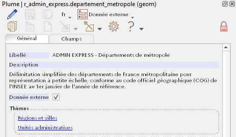

# Plume

**Attention ! Application en cours de développement, l'installation est aux risques et périls de l'utilisateur.**

Plume, pour PLUgin MEtadonnées, est un plugin QGIS de consultation et saisie des métadonnées des couches en base PostgreSQL.


Les métadonnées sont stockées au format RDF (JSON-LD) dans les descriptifs PostgreSQL des objets. L'utilisateur y accède en cliquant sur les couches dans l'explorateur de QGIS ou dans le panneau des couches. Plume prend en charge les tables, tables partionnées, tables étrangères, vues et vues matérialisées.

Il se base sur le profil [GeoDCAT-AP 2.0](https://semiceu.github.io/GeoDCAT-AP/releases/2.0.0/) de [DCAT v2](https://www.w3.org/TR/vocab-dcat-2/), qui constitue un socle de métadonnées communes et échangeables, tout en permettant une large personnalisation des catégories de métadonnées présentées à l'utilisateur lorsqu'il est couplé avec l'extension PostgreSQL *[plume_pg](/postgresql)*.


## Technologies

Plume est une application Python, avec les dépendances suivantes :
- [Python](https://www.python.org/) 3.5 ou supérieur
- [Psycopg](https://www.psycopg.org/) 2.9.1
- [RDFLib](https://rdflib.readthedocs.io/en/stable/index.html) 6.0.1 (non compatible avec la version 5)
- [Qt for Python](https://doc.qt.io/qtforpython-5/api.html) 5.15.2

La librairie RDFLib, qui n'est pas nativement présente dans les distributions de QGIS, est packagée dans le plugin et installée en parallèle. 


## Environnement

- QGIS 3.20.2 Odense, compatible 3.4 ou supérieur
- PostgreSQL 10, compatible 9.5 ou supérieur
- OS Windows 10 (10.0)


## Installation

### Automatiquement

*À venir*. Plume est disponible sur le [dépôt interministériel des plugins QGIS](http://piece-jointe-carto.developpement-durable.gouv.fr/NAT002/QGIS/plugins/plugins.xml).

Si ce dernier a été configuré comme source dans le gestionnaire d'extensions de QGIS, l'utilisateur trouvera donc Plume dans la liste des plugins du menu `Extension > Installer / Gérer les extensions`. Plume pourra être installé et mis à jour via ce dispositif.

### Manuellement

Il est également possible de télécharger une archive ZIP du code du plugin sur [GitHub](https://github.com/MTES-MCT/metadata-postgresql) et d'utiliser la fonctionnalité `Extension > Installer / Gérer les extensions > Installer depuis un zip`.


## Usage courant

1. Pour lancer Plume, cliquez sur son icône dans la barre d'outils de la fenêtre principale de QGIS : 

2. Sélectionnez une couche PostgreSQL dans l'explorateur ou le panneau des couches. Si elles ont été renseignées, ses métadonnées apparaissent dans le panneau de Plume (ou, selon la configuration, la fenêtre de Plume).



3. Si vous êtes habilité à éditer les métadonnées de la couche (membre du rôle propriétaire de la table ou de la vue), vous pouvez activer le mode édition en cliquant sur le crayon  dans la barre d'outils de Plume.


4. Une fois les modifications réalisées, cliquez sur la disquette  pour enregistrer. Vous pouvez également quitter le mode édition sans sauvegarder en cliquant de nouveau sur le crayon .


## Documentation

*À venir*. Documentation utilisateur : http://snum.scenari-community.org/Metadata/Plume/Documentation.

La documentation technique se trouve dans le répertoire [`__doc__`](/_doc__) du dépôt GitHub.


## Structure des fichiers

```bash
.                        # racine où se trouve les sources .py
│
├── bibli_install        # module d'installation de RDFLib et sources de RDFLib
├── i18n                 # fichiers des langues
└── icons                # icônes de l'application
    └── general          # icônes de la barre d'outils de Plume
    └── buttons          # icônes des boutons du formulaire généré à la volée
    └── logo             # icônes pour le menu Extension et la barre d'outils de QGIS
├── iso                  # modules pour le dialogue avec les services CSW et la conversion des métadonnées ISO 19115
├── pg                   # modules pour le dialogue avec le serveur PostgreSQL et la gestion des modèles de formulaires
├── rdf                  # modules de manipulation des métadonnées RDF

```

## Crédits

© République Française, 2021-2022.

### Production

Service du numérique du secrétariat général des Ministère de la transition écologique, Ministère de la cohésion des territoires et des relations avec les collectivités territoriales et Ministère de la Mer.

### Équipe

- Didier LECLERC (SNUM/UNI/DRC) : intégration, développement de l'interface utilisateur et de l'interface avec le serveur PostgreSQL.
- Leslie LEMAIRE (SNUM/UNI/DRC) : conception et développement des mécaniques sous-jacentes (modules des répertoires [rdf](/plume/rdf), [pg](/plume/pg) et [iso](/plume/iso)), création des logos et icônes.

### Contact

Via les issues du [dépôt GitHub](https://github.com/MTES-MCT/metadata-postgresql) ou par mél à drc.uni.snum.sg@developpement-durable.gouv.fr.


## Licence

Plume est publié sous licence GNU Affero General Public Licence v3.0 ou plus récent ([AGPL 3 ou plus récent](https://spdx.org/licenses/AGPL-3.0-or-later.html)).
